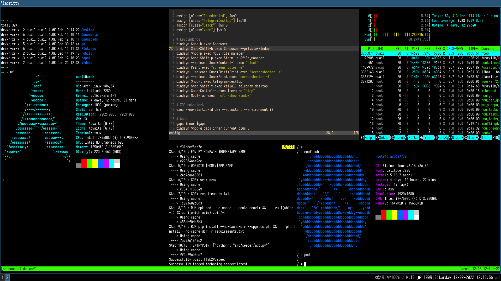

# i3 configuration file

## Keybindings

- <kbd>mod</kbd>+<kbd>b</kbd> : open `Firefox` browser
- <kbd>mod</kbd>+<kbd>Shift</kbd>+<kbd>b</kbd> : open private window of `Firefox` browser
- <kbd>mod</kbd>+<kbd>p</kbd> : open `PCManFM` file manager
- <kbd>mod</kbd>+<kbd>Shift</kbd>+<kbd>p</kbd> : open `lf` terminal-based file manager
- <kbd>mod</kbd>+<kbd>Control</kbd>+<kbd>l</kbd> : lock screen with `i3lock`
- <kbd>Print</kbd> : take a screenshot of the entire screen
- <kbd>mod</kbd>+<kbd>Print</kbd> : take a screenshot of the selected rectangle
- <kbd>mod</kbd>+<kbd>Control</kbd>+<kbd>h</kbd> : launch `htop` process viewer

### Gaps
- <kbd>mod</kbd>+<kbd>g</kbd> : increase inner gaps by 5 pixels
- <kbd>mod</kbd>+<kbd>Shift</kbd>+<kbd>g</kbd>: decrease inner gaps by 5 pixels
- <kbd>mod</kbd>+<kbd>Control</kbd>+<kbd>g</kbd>: reset inner gaps to default value
